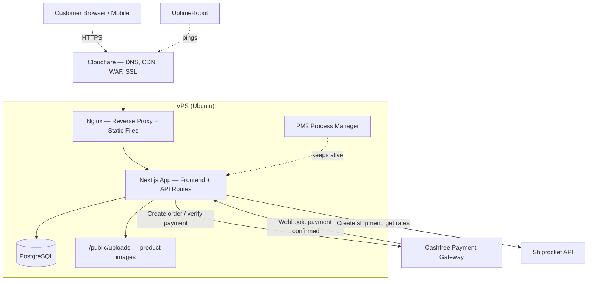

# SILVERO.925 — System Architecture

## Diagram

## Request Flow — Checkout (ties back to client Q1 and Q4)

1. Customer adds item to bag → written to DB immediately, tied to their session/account (not just browser memory)
2. Customer proceeds through checkout → each step (address, shipping method) saves to DB as they go
3. At "Pay Now" → backend opens a DB transaction, locks the product's stock row, confirms stock is available, decrements it, then creates the Cashfree order
4. Cashfree redirects customer to complete payment
5. Cashfree calls our webhook → backend verifies the signature, marks the order as paid (this is the only trusted source for "paid", never the frontend redirect alone)
6. Backend calls Shiprocket to create the shipment
7. If payment fails or times out, the stock lock from step 3 is released back

## Membership Gating — SILVERO Circle (ties back to client Q3)

1. Every request to `/circle/*` pages and `/api/circle/*` routes passes through an auth check first
2. Non-members are redirected before the page renders — they never receive the form's HTML
3. The API route that accepts form submissions independently re-checks membership server-side, so a direct API call without going through the page is rejected the same way

## Monitoring & Incident Response (ties back to client Q5)

- UptimeRobot checks the storefront and checkout flow every few minutes
- PM2 auto-restarts the app on a crash without manual intervention
- Nginx and app logs are kept on the VPS for post-incident review
- Standard incident order: restore checkout first (roll back the most recent deploy if needed) → confirm stable → investigate root cause → patch → report back

## Environments

- **Production**: live VPS, production `.env`, production Cashfree keys
- **Local dev**: each developer runs Next.js locally against either a local Postgres instance or a shared dev database, with Cashfree in sandbox mode
